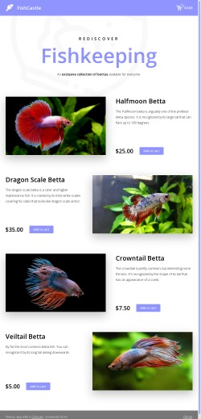

# FishCastle

---
<a href='https://nextjs.org/'></a> <a href='https://snipcart.com/'>![Snipcart](https://img.shields.io/badge/SNIPCART-3.4.0-blue.svg?style=for-the-badge&logo=data:image/svg+xml;base64,PHN2ZyB2ZXJzaW9uPSIxLjEiIGlkPSJMYXllcl8xIiB4bWxucz0iaHR0cDovL3d3dy53My5vcmcvMjAwMC9zdmciIHhtbG5zOnhsaW5rPSJodHRwOi8vd3d3LnczLm9yZy8xOTk5L3hsaW5rIiB4PSIwcHgiIHk9IjBweCIgd2lkdGg9IjEzcHgiIGhlaWdodD0iMTRweCIgdmlld0JveD0iMCAwIDEzIDE0IiBlbmFibGUtYmFja2dyb3VuZD0ibmV3IDAgMCAxMyAxNCIgeG1sOnNwYWNlPSJwcmVzZXJ2ZSI%2BICA8aW1hZ2UgaWQ9ImltYWdlMCIgd2lkdGg9IjEzIiBoZWlnaHQ9IjE0IiB4PSIwIiB5PSIwIiAgICBocmVmPSJkYXRhOmltYWdlL3BuZztiYXNlNjQsaVZCT1J3MEtHZ29BQUFBTlNVaEVVZ0FBQUEwQUFBQU9DQU1BQUFERG9XYmdBQUFBQkdkQlRVRUFBTEdQQy94aEJRQUFBQ0JqU0ZKTkFBQjZKZ0FBZ0lRQUFQb0FBQUNBNkFBQWRUQUFBT3BnQUFBNm1BQUFGM0NjdWxFOEFBQUJPMUJNVkVYL3pBRC96QUQvekFEL3pBRC96QUQvekFEL3pBRC96QUQvekFEL3pBRC96QUQvekFEL3pBRC96QUQvekFEL3pBRC96UUQvekFEL3pBRC96QUQvekFEL3pBRC96QUQvekFEL3pBRC96QUQvekFEL3pBRC96UUQvekFEL3pBRC96QUQvekFEL3pBRC96QUQvekFEL3pBRC96QUQvekFEL3pBRC96QUQvekFEL3pBRC96Z0QvMEFEMXhBRE9wQUQ3eVFEL3p3RC96UUQyeFFEVHFBQzNrZ0IyWHdCWlJ3Q0Zhd0M4bHdEWHJBRDZ5QUQreXdDSmJnQnhXd0NTZFFEQ213RHd3QUMvbVFDUGN3QnlXd0NqZ3dCelhBQjNYd0RIbndENHhnRG11QUNtaFFEeXdRQzVsQUI1WVFCc1ZnQ2ZnQURmc3dEOXl3RFpyZ0NYZVFCcVZRQi9aZ0RCbXdENXh3Q2hnUUQwd3dCd1dnQitaUUQ5eWdDUmRBQ1RkZ0R5d2dEQm1nQ05jUUROcEFDeWpnQlhSUUIwWFFDeGpnREZuZ0QvLy8rbkkzTHhBQUFBS25SU1RsTUFCbExNKzhWTEJER2U4TzJZTFJxRDVlSjlGN1dwL2ZIenRxV0M0SGtWTUozc2xTc0ZVY3ZFU1FQM044SFdBQUFBQVdKTFIwUm95MnowSWdBQUFBZDBTVTFGQitZR0FnNHdDWVdFekVrQUFBQzVTVVJCVkFqWFkyQmdZR0JrWW1aaFpXTm5BQU1PVGk0dGJTMXVIbDRnbTQ5ZlFGdEhWMC9mUUZ0UVNKaEJ4TkRJMk1UVXpOekMwa3BMbEVITTJzYld6dDdCMGNuWnhWQ2NRY3ZLMWMzZFEwZEh4OVBMV29KQlM4dmJ4OWZQUDBCTE8xQUx4TE0yQ0F3S0Rna04wd1h4d2lNY2RIUU1JaDJqb21Na2dLYkV1c2E1eHlmWStTVnFjVEZJR2hvbEpmdW1wS1lsR1JsS01mQkpBMjAzU2pmUzBaYVJsUU82Umw0QjVESkZKV1dJUTFWVTFWalVOVFNCTEFBcFVoOXZOUGlHQndBQUFDVjBSVmgwWkdGMFpUcGpjbVZoZEdVQU1qQXlNaTB3Tmkwd01sUXhORG8wT0Rvd09Dc3dNRG93TVBYbmQvTUFBQUFsZEVWWWRHUmhkR1U2Ylc5a2FXWjVBREl3TWpJdE1EWXRNREpVTVRRNk5EZzZNRGtyTURBNk1EQWl6Y1Q3QUFBQUFFbEZUa1N1UW1DQyIgLz48L3N2Zz4%3D)</a> <a href='https://firebase.google.com/'></a> <a href='https://www.netlify.com/'></a>

**E-Commerce Application with Next.js**

Next.js is the most popular framework for building React applications that support server-side rendering out of the box.

This project showed me how to create an e-commerce app that looks like this:


<a href='https://fishcastle.netlify.app/'></img></a>
## __[Live Demo](https://fishcastle.netlify.app/)__

**What I learned:**
In this project I learned how to develop with Next.js - creating new pages and components, extracting data, and styling and deploying the Next app.I also learned how to use Firebase when a good back-end developer is missing.The Snipcart platform helped me organize a commercial project with which to conveniently control all user transactions.
And all this experience helped me to create this wonderful application.

---
## Dependencies

* Next 12.1.5
* React 18.0.0
* Firebase 9.8.1
* Snipcart 3.4.0
* TypeScript 4.6.3
* and other additional tools look in [package.json](package.json)

---
## Setup

1. Install all dependencies:
    ```bash
    npm install
    ```
2. Setup firebase:
    1. Follow steps how to create own project at [firebase](https://firebase.google.com/docs/web/setup).
    2. Create ***.env.local*** file in the root directory and fill in all the values for each of the fields according to your project configurations:
    ```
    NEXT_PUBLIC_FIREBASE_API_KEY = ...
    NEXT_PUBLIC_FIREBASE_AUTH_DOMAIN = ...
    NEXT_PUBLIC_FIREBASE_PROJECT_ID = ...
    NEXT_PUBLIC_FIREBASE_STORAGE_BUCKET = ...
    NEXT_PUBLIC_FIREBASE_MESSAGING_SENDER_ID = ...
    NEXT_PUBLIC_FIREBASE_APP_ID = ...
    NEXT_PUBLIC_FIREBASE_MEASUREMENT_ID = ...
    NEXT_PUBLIC_FIREBASE_DATABSE_URL = ...
    ```
    3. Create Realtime DataBase and add information about products.
    Example:
    ```json
    {
        "products": [
            {
            "description": "The Halfmoon betta is arguably one of the prettiest betta species. It is recognized by its large tail that can flare up to 180 degrees.",
            "id": "halfmoon",
            "image": "[URL WHERE YOUR IMAGE IS STORAGING]",
            "name": "Halfmoon Betta",
            "price": 25,
            "url": "/api/products/halfmoon"
            },
            ...
        ]
    }
    ```
    >! Images can be storage in [Firebase Storage]()
3. Setup Snipcart
    1. Create [Snipcart account](https://app.snipcart.com/register)
    2. Copy [API Key](https://app.snipcart.com/dashboard/account/credentials)
    3. Paste this key in **.env.local**
    
    Example:
    ```
    NEXT_PUBLIC_SNIPCART_API_KEY="[API KEY]"
    ```
    4. Add your deploy domain in this [section](https://app.snipcart.com/dashboard/account/domains)
4. (Optional)Deployments Guide:  
    [Vercel](https://vercel.com/docs/concepts/deployments/overview)  
    [Netlify](https://www.netlify.com/blog/2016/09/29/a-step-by-step-guide-deploying-on-netlify/)
5. Run project:
    ```bash
    npm run dev
    ```
---
## Learn More

To learn more about Next.js, Snipcart and Firebase, take a look at the following resources:

- [Next.js Documentation](https://nextjs.org/docs) - learn about Next.js features and API.
- [Snipcart Documentation](https://docs.snipcart.com/v3/setup/installation) - learn how to setup and usages Snipcart in your projects.
- [Firebase Documentation](https://firebase.google.com/docs/web/setup) - learn how to integrate Firebase in your Web application.
- [Develop a Snipcart Powered Website Locally Using ngrok](https://snipcart.com/blog/develop-a-snipcart-powered-website-locally-using-ngrok) - Test locally with Snipcart.
